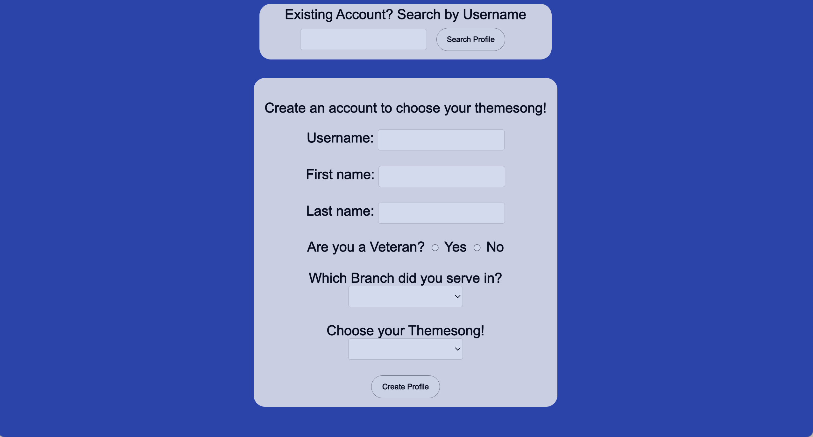
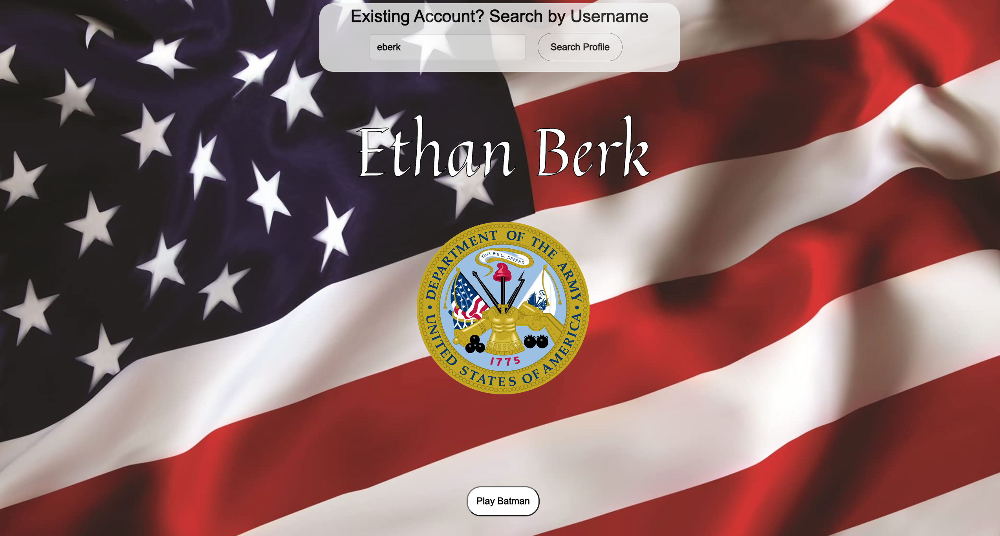
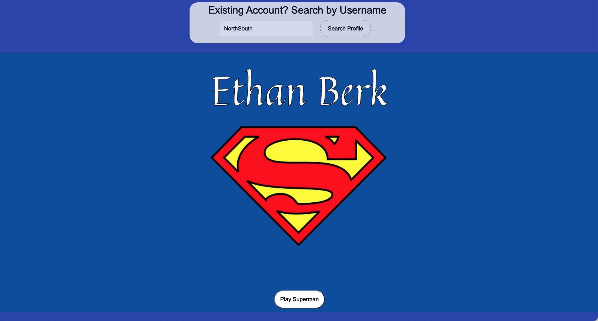

# Theme Song Profile Creator

## Overview

https://mvp-theme-song.onrender.com

This repository contains the code for a full-stack web application that allows users to create profiles and choose their theme songs based on their military branch and preferences. The application is built using JavaScript, PostgreSQL for the database, HTML, and CSS. It also utilizes the Band.js library for playing theme songs.

## Features

- **Profile Creation**: Users can create profiles by providing details such as username, first name, last name, veteran status, military branch, and their preferred theme song.
- **Profile Lookup**: Existing users can be searched by their username to view and listen to their selected theme song.

- **Theme Songs**: Users can choose from a selection of theme songs associated with various military branches.

## Technologies Used

- **JavaScript**: The primary programming language for the application logic.
- **PostgreSQL**: The relational database management system used to store and retrieve user profiles.

- **HTML and CSS**: Responsible for the structure and styling of the user interface.

- **Band.js Library**: Used for playing theme songs within the application.

## How to Run

1. Clone the repository to your local machine.

   ```bash
   git clone https://github.com/ethanberke/mvp
   ```

2. Execute the following SQL script:

```sql
-- Create tables
CREATE TABLE profiles (
    id SERIAL PRIMARY KEY,
    username TEXT NOT NULL UNIQUE,
    first_name TEXT NOT NULL,
    last_name TEXT NOT NULL,
    veteran BOOLEAN NOT NULL,
    branch_id INT,
    song_id INT NOT NULL
);

CREATE TABLE songs (
    id SERIAL PRIMARY KEY,
    name TEXT
);

CREATE TABLE service_branches (
    id SERIAL PRIMARY KEY,
    name TEXT,
    imgurl TEXT
);

-- Insert sample data
INSERT INTO songs (name) VALUES
    ('Batman'),
    ('Final Countdown'),
    ('Hawaii Five-O'),
    ('Jump'),
    ('Mario'),
    ('Superman'),
    ('Spanish Flea');

INSERT INTO service_branches (name, imgurl) VALUES
    ('Army', 'https://www.defense.gov/portals/1/Page-Assets/branding-guide/armed-forces/sealArmy.png'),
    ('Marine Corps', 'https://www.defense.gov/portals/1/Page-Assets/branding-guide/armed-forces/sealMarineCorps.png'),
    ('Navy', 'https://www.defense.gov/portals/1/Page-Assets/branding-guide/armed-forces/sealNavy.png'),
    ('Air Force', 'https://www.defense.gov/portals/1/Page-Assets/branding-guide/armed-forces/sealAirForce.png'),
    ('Space Force', 'https://www.defense.gov/portals/1/Page-Assets/branding-guide/armed-forces/SealSpaceForce.png'),
    ('Coast Guard', 'https://www.defense.gov/portals/1/Page-Assets/branding-guide/armed-forces/sealCoastGuard.png');


3. Open the project in your preferred code editor.

4. Run the application by opening the `index.html` file in a web browser.

## Usage

- **Creating a Profile**: Fill out the form in the "Create Profile" section with the required details and click the "Create Profile" button.

- **Searching for a Profile**: Enter an existing username in the "Existing Account? Search by Username" section and click the "Search Profile" button.

- **Listening to Theme Songs**: After creating or searching for a profile, users can click on the corresponding buttons to play their chosen theme song.

## Screenshots

_Opening Screen to create profile_


_Example of Veteran Profile_


_Example of Non-Veteran Profile__

## Contributing

Feel free to contribute to this project by opening issues or submitting pull requests.

## Acknowledgments

- Thanks to [Band.js](https://github.com/meenie/band.js/) for providing the library for playing theme songs.

## Contact

For any inquiries, please contact Ethan Berkebile via email at ethanberkebile@gmail.com.

**Thank you for visiting!** 🚀
```
